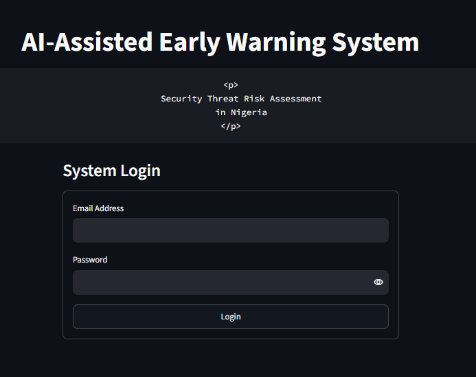
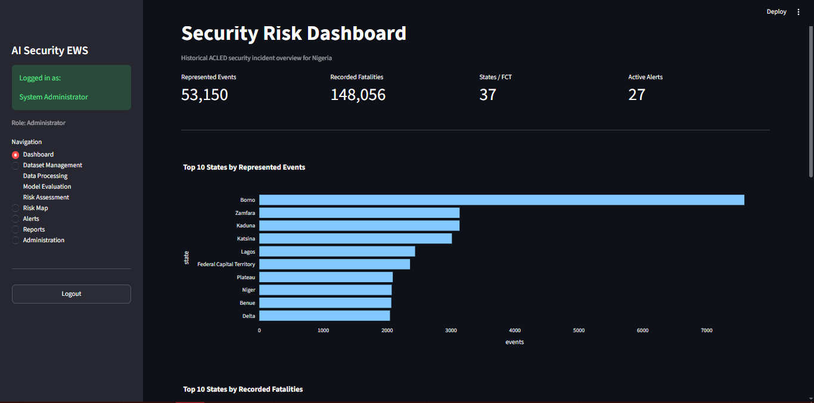
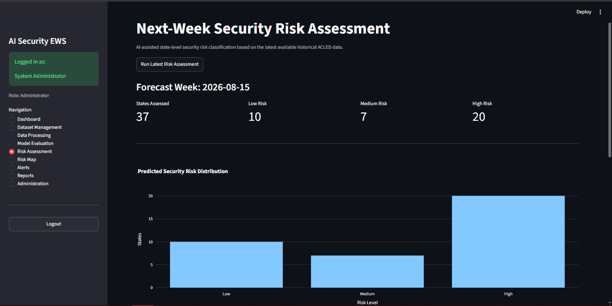
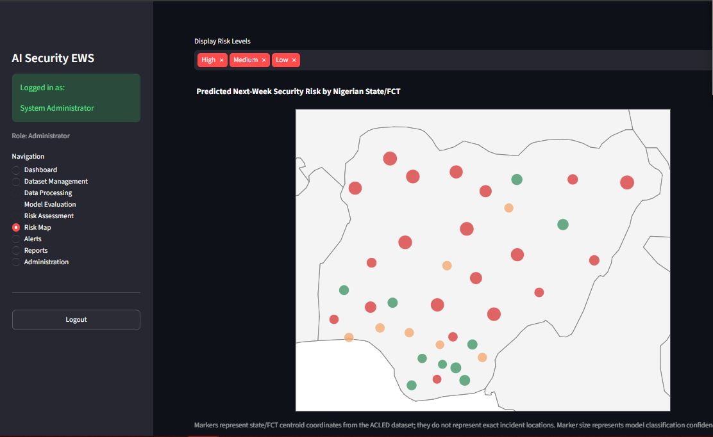
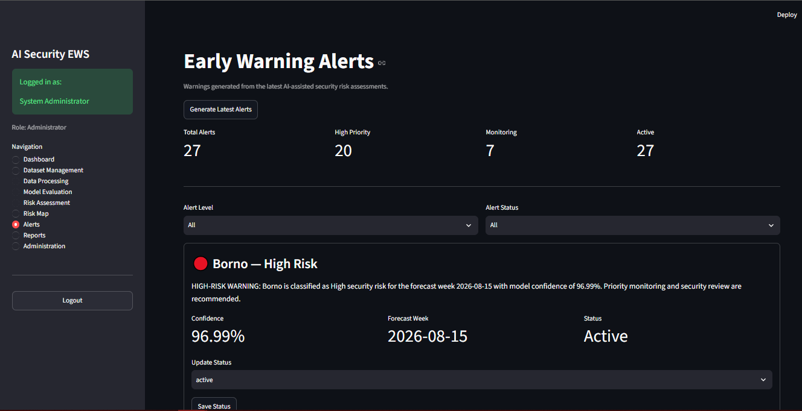
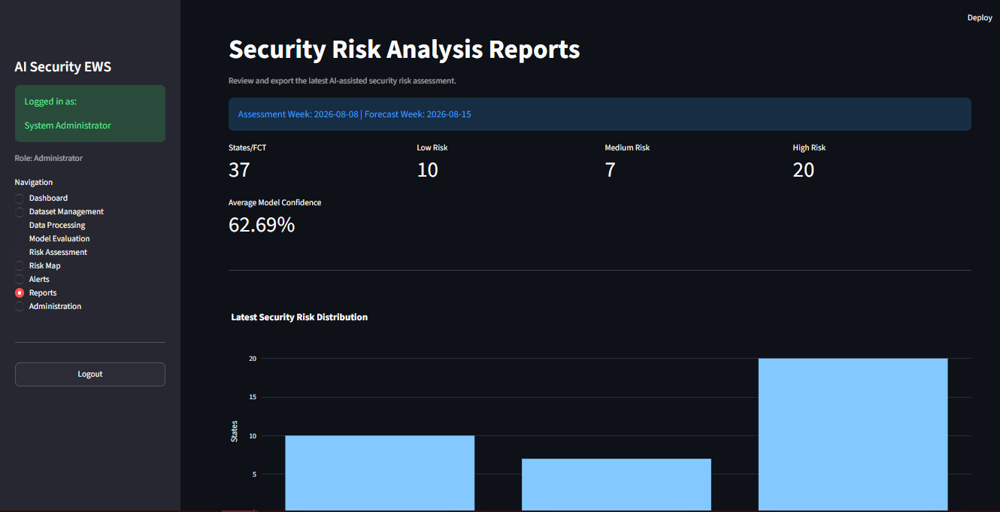

# AI-Assisted Early Warning System for Security Threat Risk Assessment in Nigeria

An AI-assisted machine learning prototype for analysing historical security-event data and predicting **next-week state-level security risk** across Nigeria.

The system classifies each of Nigeria's **36 states and the Federal Capital Territory (FCT)** into **Low, Medium, or High risk** and presents the results through an interactive Streamlit application.

> **Project Scope:** This is an academic research prototype based on historical security data. Predictions represent estimated risk levels and should not be interpreted as confirmation that a security incident will occur.

---

# PART A — PROJECT INFORMATION

## 1. Overview

The **AI-Assisted Early Warning System for Security Threat Risk Assessment in Nigeria** is designed to support early identification of potential security risk using historical patterns in security-event data.

The system processes historical **ACLED** data, aggregates security information at state-week level, engineers predictive features, and applies machine learning to estimate the security risk level for the following week.

The application provides:

- State-level security risk assessment
- Low, Medium, and High risk classification
- Interactive security risk dashboard
- Geographic risk visualisation
- Automated risk alerts
- CSV and Excel report generation
- Role-based user administration
- System activity audit logging

---

## 2. Project Objectives

The project aims to:

1. Design an early warning framework for classifying security threat risk levels.
2. Develop security risk classification models using **Decision Tree** and **Random Forest** algorithms.
3. Evaluate the developed models using appropriate machine-learning performance metrics.
4. Provide an interactive application for viewing risk assessments, geographic patterns, alerts, and reports.

---

## 3. Key Features

| Feature                 | Description                                                   |
| ----------------------- | ------------------------------------------------------------- |
| **Authentication**      | Role-based login for authorised users                         |
| **Dashboard**           | Provides an overview of security-event and risk information   |
| **Risk Assessment**     | Generates next-week state-level security risk predictions     |
| **Risk Classification** | Classifies predicted risk as Low, Medium, or High             |
| **Risk Map**            | Visualises predicted risk geographically across Nigeria       |
| **Alerts**              | Generates warnings for Medium and High risk assessments       |
| **Reports**             | Generates downloadable CSV and Excel risk reports             |
| **Administration**      | Supports user and role management                             |
| **Audit Logs**          | Records significant system activities                         |
| **Model Evaluation**    | Supports comparison of Decision Tree and Random Forest models |

---

## 4. Screenshots

### Login Interface



### Dashboard



### Risk Assessment



### Security Risk Map



### Alerts



### Reports



---

## 5. System Architecture

The system follows a layered architecture connecting historical security data, data processing, machine learning, database services, and the Streamlit user interface.

```text
                  ACLED Historical Dataset
                           │
                           ▼
                  Data Loading & Validation
                           │
                           ▼
                       Preprocessing
                           │
                           ▼
                  State-Week Aggregation
                           │
                           ▼
                   Feature Engineering
                           │
                           ▼
                   Risk Label Engineering
                           │
                           ▼
             ┌──────────────────────────┐
             │ Machine Learning Models  │
             │                          │
             │ • Decision Tree          │
             │ • Random Forest          │
             └────────────┬─────────────┘
                          │
                          ▼
                 Model Evaluation
                          │
                          ▼
                  Selected Model
                          │
                          ▼
             Next-Week Risk Assessment
                          │
                          ▼
                    MySQL Database
                          │
                          ▼
                Streamlit Application
                          │
             ┌────────────┼─────────────┐
             ▼            ▼             ▼
          Risk Map      Alerts        Reports

```

## 6. Technologies Used

The system is implemented using a combination of **machine learning, data-processing, database, visualisation, and web-application technologies**.

```text
| Technology | Purpose |
|---|---|
| **Python 3.11** | Core programming language for application and machine-learning development |
| **Streamlit** | Interactive web application and user interface |
| **Pandas** | Data loading, cleaning, transformation, aggregation, and analysis |
| **NumPy** | Numerical processing and feature computation |
| **Scikit-learn** | Machine-learning training, tuning, prediction, and evaluation |
| **MySQL/MariaDB** | Persistent storage of application and risk-assessment data |
| **SQLAlchemy** | Object-Relational Mapping (ORM) and database interaction |
| **PyMySQL** | Python-to-MySQL/MariaDB connectivity |
| **Plotly** | Interactive charts and geographic risk visualisation |
| **Matplotlib** | Machine-learning evaluation visualisations |
| **Joblib** | Serialisation and persistence of trained machine-learning models |
| **OpenPyXL** | Excel processing and report generation |
| **Pytest** | Automated unit, integration, and system testing |
| **bcrypt** | Secure password hashing |
| **python-dotenv** | Local environment and database configuration management |
```

### Technology Stack Overview

```text
┌─────────────────────────────────────────────────────────┐
│                  PRESENTATION LAYER                     │
│                       Streamlit                         │
├─────────────────────────────────────────────────────────┤
│                 VISUALISATION LAYER                     │
│                  Plotly / Matplotlib                    │
├─────────────────────────────────────────────────────────┤
│              MACHINE-LEARNING LAYER                     │
│           Scikit-learn / Pandas / NumPy                 │
├─────────────────────────────────────────────────────────┤
│                 APPLICATION LAYER                       │
│                       Python 3.11                       │
├─────────────────────────────────────────────────────────┤
│                    DATA LAYER                           │
│        MySQL/MariaDB / SQLAlchemy / PyMySQL             │
└─────────────────────────────────────────────────────────┘
```

---

## 7. Dataset

### 7.1 Data Source

The system uses historical security-event data from the **Armed Conflict Location & Event Data (ACLED)** project.

The source dataset contains **weekly aggregated security-event information across Africa**. During preprocessing, records relating to **Nigeria** are extracted, validated, transformed, and prepared for state-level security risk analysis.

> **Project Scope:** The current system uses a locally stored historical ACLED dataset. It does not currently retrieve live security events from the ACLED API.

---

### 7.2 Dataset Coverage

The Nigerian subset provides historical security-event information across:

- **36 states and the Federal Capital Territory (FCT)**
- Weekly security-event observations
- Event types and sub-event types
- Event frequencies
- Fatalities
- Population exposure
- Administrative locations
- Geographic centroid coordinates

The main source variables include:

| Variable              | Description                                          |
| --------------------- | ---------------------------------------------------- |
| `WEEK`                | Week associated with the aggregated observation      |
| `COUNTRY`             | Country represented by the record                    |
| `ADMIN1`              | First-level administrative area — Nigerian state/FCT |
| `EVENT_TYPE`          | General category of security event                   |
| `SUB_EVENT_TYPE`      | More specific classification of the event            |
| `EVENTS`              | Number of recorded events                            |
| `FATALITIES`          | Number of recorded fatalities                        |
| `POPULATION_EXPOSURE` | Population-exposure information                      |
| `CENTROID_LATITUDE`   | Latitude of the administrative centroid              |
| `CENTROID_LONGITUDE`  | Longitude of the administrative centroid             |

---

### 7.3 State-Week Aggregation

The original Nigeria records are transformed into a **state-week analytical dataset**.

Each processed observation represents:

```text
┌─────────────────┐
│    ONE STATE    │
│        +        │
│    ONE WEEK     │
├─────────────────┤
│ ONE STATE-WEEK  │
│   OBSERVATION   │
└─────────────────┘
```

In simplified form:

> **One State + One Week = One State-Week Observation**

This structure enables the machine-learning models to analyse how security conditions develop over time within each Nigerian state.

---

### 7.4 Security-Event Features

Security-event categories are aggregated to generate variables describing the frequency, composition, and severity of recorded security activity.

Key variables include:

| Category                      | Examples                                                                      |
| ----------------------------- | ----------------------------------------------------------------------------- |
| **General Activity**          | Total events, total fatalities                                                |
| **Conflict Events**           | Battles, armed clashes                                                        |
| **Civilian Threats**          | Violence against civilians, attacks, abductions                               |
| **Explosive Events**          | Explosions/remote violence, remote explosives/IED events, suicide bomb events |
| **Public Disorder**           | Riots, protests                                                               |
| **Derived Severity Measures** | Violent events, high-severity events                                          |

Two important derived descriptive features are:

```text
Violent Events
    =
Battles
    +
Violence Against Civilians
    +
Explosions / Remote Violence
```

and:

```text
High-Severity Events
    =
Armed Clashes
    +
Attacks
    +
Abductions
    +
Remote Explosives / IED
    +
Suicide Bomb Events
```

> **Note:** These derived variables are predictive/descriptive features used by the analytical pipeline. They are not themselves the final Low, Medium, or High risk labels.

---

### 7.5 Geographic Data

The dataset contains latitude and longitude values that support state-level geographic visualisation within the application.

> [!IMPORTANT]
> The coordinates used by the system represent **administrative centroids**. They must not be interpreted as the precise locations of individual security incidents.

The Risk Map therefore represents **state-level risk conditions**, not exact incident locations.

---

## 8. Machine-Learning Pipeline

### 8.1 Prediction Objective

The machine-learning component performs a **next-week state-level security risk classification**.

For each state, information available up to historical week **`t`** is used to estimate the security risk level for the following week **`t+1`**.

### Prediction Flow

```text
┌─────────────────────────────┐
│     Historical Week (t)     │
└──────────────┬──────────────┘
               │
               ▼
┌─────────────────────────────┐
│     Feature Engineering     │
│                             │
│  • Lag Features             │
│  • Rolling Features         │
│  • Trend Features           │
│  • Event Features           │
│  • Temporal Features        │
└──────────────┬──────────────┘
               │
               ▼
┌─────────────────────────────┐
│   Machine-Learning Models   │
│                             │
│  • Decision Tree            │
│  • Random Forest            │
└──────────────┬──────────────┘
               │
               ▼
┌─────────────────────────────┐
│         Prediction          │
└──────────────┬──────────────┘
               │
               ▼
┌─────────────────────────────┐
│     Next Week Risk (t+1)    │
└──────────────┬──────────────┘
               │
               ▼
     ┌─────────┼─────────┐
     ▼         ▼         ▼
   ┌─────┐  ┌────────┐  ┌──────┐
   │ LOW │  │ MEDIUM │  │ HIGH │
   └─────┘  └────────┘  └──────┘
```

---

### 8.2 Feature Engineering

Historical state-week observations are transformed into predictive variables representing recent security behaviour and changes over time.

The engineered feature groups include:

| Feature Group         | Purpose                                              |
| --------------------- | ---------------------------------------------------- |
| **Lag Features**      | Represent security conditions from previous weeks    |
| **Rolling Features**  | Summarise patterns across recent historical windows  |
| **Trend Features**    | Measure increases or decreases in security activity  |
| **Event Features**    | Represent event frequency, composition, and severity |
| **Temporal Features** | Capture relevant calendar/time information           |

Examples of trend information include changes in:

- total events;
- fatalities;
- violent events;
- high-severity events;
- abductions.

The feature-engineering process allows the models to learn from **historical behaviour and changes in security conditions**, rather than relying only on the current week's event totals.

---

### 8.3 Next-Week Target

The forecasting relationship can be represented as:

```text
Features available at Week t
             │
             │  Machine-Learning Model
             ▼
    Risk Level at Week t+1
```

Therefore:

```text
X(t)  ─────────────►  Risk(t+1)
```

This distinction is important because the model is designed to estimate **future risk relative to the available historical observation**, rather than merely classify the same week's security conditions.

---

### 8.4 Chronological Train/Test Split

The dataset is divided into **training and testing sets chronologically**.

```text
                         TIME
────────────────────────────────────────────────────────────►

 Earlier Historical Data                    Later Data

┌─────────────────────────────┐   ┌─────────────────────────┐
│        TRAINING DATA        │   │        TEST DATA        │
│                             │   │                         │
│   Model learns from past    │   │ Evaluation on later     │
│       observations          │   │ unseen observations     │
└─────────────────────────────┘   └─────────────────────────┘
                         ▲
                         │
                    Split Point
```

#### Why Random Splitting Was Avoided

A conventional random train/test split was avoided because the dataset contains **time-dependent security observations**.

Randomly mixing earlier and later observations could:

- place future observations in the training data;
- place earlier observations in the test data;
- weaken the temporal integrity of the forecasting task;
- produce an unrealistic estimate of future predictive performance.

The chronological approach ensures that:

> **Earlier observations → Model Training → Later unseen observations → Model Evaluation**

This better represents the intended **next-week forecasting scenario**.

---

### 8.5 Machine-Learning Models

Two supervised classification algorithms are implemented and evaluated.

#### Decision Tree Classifier

The **Decision Tree** provides a tree-based classification model capable of learning nonlinear decision rules from the engineered security features.

#### Random Forest Classifier

The **Random Forest** combines multiple decision trees into an ensemble classifier to improve generalisation and reduce dependence on the decisions of a single tree.

### Models Implemented

| Model                        | Status                |
| ---------------------------- | --------------------- |
| **Decision Tree Classifier** | Trained and evaluated |
| **Random Forest Classifier** | Trained and evaluated |

Both models use the same forecasting framework and are evaluated using the chronological test dataset.

---

### 8.6 Model Training and Tuning

Model development follows the general process:

```text
Training Dataset
       │
       ▼
Time-Series Cross-Validation
       │
       ▼
Hyperparameter Tuning
       │
       ▼
Candidate Models
       │
       ▼
Chronological Test Evaluation
       │
       ▼
Model Comparison
       │
       ▼
Final Model Selection
```

Model tuning uses **time-aware cross-validation** and **Macro F1** as the principal optimisation criterion.

This approach is particularly important because the three risk categories must be considered collectively rather than allowing overall performance to be dominated by one class.

---

### 8.7 Selected Model

The final model selected for deployment is:

> ## **Random Forest Classifier**

The deployed model is stored at:

```text
models/selected_model.pkl
```

The application loads this model when generating operational next-week state-level risk assessments.

### Model Selection Criteria

The model-comparison procedure prioritises:

1. **Macro F1**
2. **High-Risk Recall**
3. **Accuracy**

This selection strategy considers both overall multiclass performance and the system's ability to identify observations belonging to the **High-risk** category.

---

### 8.8 Evaluation Metrics

Model performance is evaluated using multiple classification metrics.

| Metric               | Purpose                                                                           |
| -------------------- | --------------------------------------------------------------------------------- |
| **Accuracy**         | Measures the overall proportion of correctly classified observations              |
| **Macro Precision**  | Calculates precision for each risk class and gives each class equal importance    |
| **Macro Recall**     | Calculates recall across Low, Medium, and High risk classes with equal weighting  |
| **Macro F1**         | Balances precision and recall across all three risk classes                       |
| **High-Risk Recall** | Measures the proportion of actual High-risk observations correctly identified     |
| **Confusion Matrix** | Shows correct and incorrect predictions across Low, Medium, and High risk classes |

#### Why Macro F1 Is Important

The classification task contains three risk categories:

```text
LOW       │
MEDIUM    ├──► Equal consideration during Macro F1 calculation
HIGH      │
```

Macro F1 calculates class-level performance before averaging across the classes. This prevents evaluation from relying solely on overall accuracy where class distributions may differ.

---

### 8.9 Model Performance

The final performance values should be populated directly from the project's saved model-evaluation outputs.

| Model             |           Accuracy |    Macro Precision |       Macro Recall |           Macro F1 |   High-Risk Recall |
| ----------------- | -----------------: | -----------------: | -----------------: | -----------------: | -----------------: |
| **Decision Tree** | _Check the system_ | _Check the system_ | _Check the system_ | _Check the system_ | _Check the system_ |
| **Random Forest** | _Check the system_ | _Check the system_ | _Check the system_ | _Check the system_ | _Check the system_ |

---

### 8.10 Risk Classification

The model produces one of three state-level risk classifications:

| Classification  | Interpretation                                      | System Response     |
| --------------- | --------------------------------------------------- | ------------------- |
| **Low Risk**    | Comparatively lower predicted security threat risk  | Routine observation |
| **Medium Risk** | Elevated predicted security threat conditions       | Monitoring warning  |
| **High Risk**   | Comparatively higher predicted security threat risk | Priority warning    |

The overall prediction process is therefore:

```text
Historical Security Data
          │
          ▼
State-Week Features
          │
          ▼
Selected Random Forest Model
          │
          ▼
Next-Week Prediction
          │
          ▼
┌────────────┬────────────┬────────────┐
│  LOW RISK  │MEDIUM RISK │ HIGH RISK  │
└────────────┴────────────┴────────────┘
```

> [!WARNING]
> A **High Risk** prediction does not mean that a security incident or attack is certain to occur. It indicates that the model has identified historical patterns associated with a comparatively elevated risk classification for the forecast period.

---

### 8.11 Machine-Learning Scope

The machine-learning component should be understood as an **AI-assisted early-warning and decision-support mechanism**.

It provides:

- historical pattern analysis;
- state-level next-week risk classification;
- prediction confidence where available;
- risk prioritisation;
- input for the system's alerts, maps, and reports.

It does **not** provide:

- certainty that an attack will occur;
- exact prediction of an incident location;
- exact prediction of an attack time;
- live national intelligence;
- automatic emergency-service notification.

The output should therefore be interpreted as a **risk assessment**, not a deterministic prediction of future security incidents.

---

# PART B — COMPLETE INSTALLATION GUIDE

This section provides the complete procedure for installing and configuring the **AI-Assisted Early Warning System for Security Threat Risk Assessment in Nigeria** on a Windows computer.

> **Important:** Complete the installation steps in the order presented below. First-time users do not need to type Python commands where the provided automated `.bat` files are available.

---

## 12. Repository Structure

After downloading and extracting the project, the main repository should have the following structure:

```text
security_ews/
│
├── app.py
├── README.md
├── requirements.txt
├── .env.example
├── .gitignore
├── setup_windows.bat
├── run_setup_check.bat
├── run_system.bat
├── setup_check.py
│
├── config/
│
├── database/
│   ├── connection.py
│   ├── models.py
│   └── setup/
│       └── security_ews.sql
│
├── services/
├── pages_ui/
├── utils/
│
├── models/
│   ├── decision_tree.pkl
│   ├── random_forest.pkl
│   └── selected_model.pkl
│
├── data/
│   ├── raw/
│   ├── processed/
│   └── exports/
│
├── tests/
├── docs/
└── defence/
```

### Major Project Components

| Component                         | Purpose                                                                                       |
| --------------------------------- | --------------------------------------------------------------------------------------------- |
| `app.py`                          | Main entry point for the Streamlit application                                                |
| `config/`                         | Application configuration and settings                                                        |
| `database/`                       | Database connection, models, and database setup files                                         |
| `database/setup/security_ews.sql` | SQL file used to create/import the project database                                           |
| `services/`                       | Core application, machine-learning, assessment, alert, reporting, and administrative services |
| `pages_ui/`                       | Streamlit user-interface pages                                                                |
| `utils/`                          | Shared utility functions                                                                      |
| `models/`                         | Trained Decision Tree, Random Forest, and selected deployment model                           |
| `data/raw/`                       | Original project dataset                                                                      |
| `data/processed/`                 | Processed and engineered datasets                                                             |
| `data/exports/`                   | Generated system reports and exported files                                                   |
| `tests/`                          | Automated system tests                                                                        |
| `docs/`                           | Project documentation and screenshots                                                         |
| `defence/`                        | Files supporting stable project demonstration and defence                                     |
| `requirements.txt`                | Required Python packages and versions                                                         |
| `.env.example`                    | Template for local database configuration                                                     |
| `setup_windows.bat`               | Automated Windows environment setup                                                           |
| `setup_check.py`                  | Performs system-readiness checks                                                              |
| `run_setup_check.bat`             | Runs the setup checker automatically                                                          |
| `run_system.bat`                  | Starts the application automatically                                                          |

> **Do not move individual files out of the project folder.** The application depends on the repository structure and relative file paths.

---

# INSTALLATION

## 13. System Requirements

Before installing the application, ensure that the computer meets the following requirements.

### 13.1 Recommended Computer Requirements

| Requirement             | Recommended Specification                |
| ----------------------- | ---------------------------------------- |
| **Operating System**    | Windows 10 or Windows 11                 |
| **Architecture**        | 64-bit                                   |
| **RAM**                 | 8 GB or higher                           |
| **Free Storage**        | At least 5 GB                            |
| **Browser**             | Google Chrome or Microsoft Edge          |
| **Internet Connection** | Required for initial downloads and setup |

### 13.2 Required Software

The following software is required:

- **Python 3.11.x**
- **XAMPP**
- **Google Chrome or Microsoft Edge**
- **Git — Optional**

> **Git is not required for normal installation.** Users who are unfamiliar with Git can download the complete repository as a ZIP file from GitHub.

---

## 14. Required Software Downloads

### 14.1 Python 3.11

The project is configured for **Python 3.11**.

#### Tested Installer

Kindly use the tested installer from the Google drive since python no longer suppor the download of older versions like the Python 3.11.\*

[Download Python From Drive](https://drive.google.com/file/d/1lB49zA95Qf1-JJXaQXx--do_2xvKY8bw/view?usp=sharing)

> **Important:** Install Python 3.11 rather than replacing it with a newer major Python version. This helps maintain compatibility with the Python packages and trained machine-learning environment used by the project.

---

### 14.2 XAMPP

XAMPP provides the local **MySQL/MariaDB database server** and **phpMyAdmin** interface required by the application.

#### Tested Installer

**Google Drive:**
[Download XAMPP From Drive](https://drive.google.com/file/d/1JyGA5deTslTsrOk71xLDTiuBiqC3DEpQ/view?usp=sharing)

#### Official XAMPP Website

[Download XAMPP](https://www.apachefriends.org/download.html)

---

## 15. Download the Project

The complete source code can be downloaded directly from the project's GitHub repository.

### 15.1 Option A — Download ZIP (Recommended)

This is the recommended method for users who do not use Git.

1. Open the project's GitHub repository.
2. Click the green **`Code`** button.
3. Select **`Download ZIP`**.
4. Wait for the download to complete.
5. Open the **Downloads** folder.
6. Locate:

```text
security_ews-main.zip
```

7. Right-click the ZIP file.
8. Select **Extract All**.
9. Move or extract the project to a simple location E.g Your desktop or:

```text
C:\security_ews
```

The resulting folder should contain:

```text
C:\security_ews\
    app.py
    README.md
    requirements.txt
    setup_windows.bat
    run_setup_check.bat
    setup_check.py
    database\
    models\
    services\
    pages_ui\
    ...
```

> **Recommended:** Avoid placing the project inside several deeply nested folders. A short path such as `C:\security_ews` makes installation and troubleshooting easier.

---

### 15.2 Option B — Clone with Git

Users who already have Git installed may clone the repository.

```bash
git clone <REPOSITORY-URL>
cd security_ews
```

> This option is not required for normal project installation.

---

## 16. Install Python 3.11

### 16.1 Start the Installer

Locate the downloaded Python 3.11 installer and double-click it.

### 16.2 Enable Python PATH

On the first installation screen:

> **Tick the checkbox labelled `Add python.exe to PATH`.**

This is important because it allows Windows and the project's automated setup tools to locate Python.

### 16.3 Install Python

1. Select **Install Now**.
2. Allow the installation to complete.
3. Select **Close** when installation finishes.

### 16.4 Python Verification

Manual command-line verification is not required during the normal installation process.

The project's automated setup and setup-check utilities will verify that Python is available.

> If Python cannot be detected later, return to the [Troubleshooting](#troubleshooting) section of this README.

---

## 17. Install XAMPP

### 17.1 Run the Installer

1. Locate the downloaded XAMPP installer.
2. Double-click the installer.
3. Allow Windows to run the installation.
4. Complete the installation using the default installation directory where possible.

The typical installation location is:

```text
C:\xampp
```

### 17.2 Open XAMPP Control Panel

After installation:

1. Open **XAMPP Control Panel**.
2. Locate **MySQL**.
3. Click **Start**.

MySQL should display a running status.

### 17.3 Start Apache for phpMyAdmin

For convenient access to phpMyAdmin:

1. Locate **Apache**.
2. Click **Start**.

The XAMPP Control Panel should now show:

```text
Apache    Running
MySQL     Running
```

> **Important:** XAMPP does **not** run the AI application. MySQL/MariaDB provides the application's database, while **Python and Streamlit** run the AI-assisted early warning application.

---

## 18. Database Setup

The application requires the supplied `security_ews` database.

The SQL database file is located at:

```text
database/setup/security_ews.sql
```

### 18.1 Start the Required XAMPP Services

Open **XAMPP Control Panel** and start:

```text
Apache
MySQL
```

Both services should be running before proceeding.

---

### 18.2 Open phpMyAdmin

Open a web browser and navigate to:

[http://localhost/phpmyadmin](http://localhost/phpmyadmin)

The phpMyAdmin interface should appear.

---

### 18.3 Create the Database

1. Click **New** on the left side of phpMyAdmin.
2. Under **Database name**, enter:

```text
security_ews
```

3. Click **Create**.

The new database should appear in the left navigation panel.

---

### 18.4 Select the Database

Click:

```text
security_ews
```

from the left navigation panel.

Ensure that `security_ews` is selected before importing the SQL file.

---

### 18.5 Open the Import Tool

From the top menu, click:

```text
Import
```

---

### 18.6 Select the SQL File

Click **Choose File**.

Navigate to the extracted project directory and select:

```text
security_ews
└── database
    └── setup
        └── security_ews.sql
```

---

### 18.7 Import the Database

Scroll to the bottom of the phpMyAdmin import page and click:

```text
Go
```

Wait until phpMyAdmin confirms that the import has completed successfully.

---

### 18.8 Verify the Database Tables

After the import, select the `security_ews` database again.

The database should contain the application's tables, including:

```text
alerts
audit_logs
datasets
incident_types
locations
model_metrics
model_runs
reports
risk_assessments
roles
security_incidents
users
weekly_features
```

### Database Verification Checklist

Before proceeding, confirm:

- [ ] `security_ews` database exists
- [ ] SQL import completed successfully
- [ ] Database tables are visible
- [ ] MySQL is running in XAMPP

> If the database does not contain the expected tables, do not continue to the application. Recheck that `database/setup/security_ews.sql` was imported into the correct database.

---

## 19. Python Environment Setup

The project includes an automated Windows setup utility.

### 19.1 Locate the Setup File

Open the extracted project folder:

```text
C:\security_ews
```

Locate:

```text
setup_windows.bat
```

### 19.2 Run the Automated Setup

Double-click:

```text
setup_windows.bat
```

No Python commands need to be entered manually.

### 19.3 What the Automated Setup Does

The setup utility prepares the local Python environment required by the application.

It performs the required setup operations, including:

```text
Python Detection
       │
       ▼
Virtual Environment Creation
       │
       ▼
Python Package Installation
       │
       ▼
Project Environment Preparation
```

In particular, it:

- checks that Python is available;
- creates the project's `.venv` virtual environment;
- uses the virtual environment for the project;
- installs the packages specified in `requirements.txt`;
- prepares the local application environment.

### 19.4 Allow Installation to Finish

Do not close the setup window while packages are being installed.

The first installation may take several minutes depending on the computer and internet connection.

> The automated setup normally needs to be completed only once on a new computer.

---

## 20. Environment Configuration

Database connection information is stored locally using an environment file.

The repository provides:

```text
.env.example
```

The working application uses:

```text
.env
```

Kindly rename the file from .env.example to .env (remove the .example from the file name)

### 20.1 Standard XAMPP Configuration

For a standard local XAMPP installation, the configuration is:

```env
DB_HOST=localhost
DB_PORT=3306
DB_NAME=security_ews
DB_USER=root
DB_PASSWORD=
```

### 20.2 Configuration Meaning

| Variable      | Purpose                 | Standard Local Value                   |
| ------------- | ----------------------- | -------------------------------------- |
| `DB_HOST`     | Database server address | `localhost`                            |
| `DB_PORT`     | MySQL/MariaDB port      | `3306`                                 |
| `DB_NAME`     | Application database    | `security_ews`                         |
| `DB_USER`     | Database username       | `root`                                 |
| `DB_PASSWORD` | Database password       | Blank for a default XAMPP installation |

### 20.3 Creating `.env`

If the automated setup has already created `.env`, no additional action is required.

Otherwise:

1. Locate:

```text
.env.example
```

2. Make a copy of the file.
3. Rename the copy to:

```text
.env
```

4. Open `.env`.
5. Confirm that the database settings correspond to the local XAMPP configuration.

For the standard configuration:

```env
DB_HOST=localhost
DB_PORT=3306
DB_NAME=security_ews
DB_USER=root
DB_PASSWORD=
```

6. Save and close the file.

> **Security Notice:** `.env` contains machine-specific configuration and must **not** be committed or uploaded to a public GitHub repository. The repository should contain `.env.example`, while each installation maintains its own local `.env`.

---

## 21. Automatic Setup Check

After completing the installation and database configuration, verify the complete system before starting the application.

### 21.1 Before Running the Check

Ensure that:

- [ ] Python 3.11 is installed
- [ ] XAMPP is installed
- [ ] MySQL is running
- [ ] `security_ews` database has been imported
- [ ] `setup_windows.bat` has completed
- [ ] `.env` exists and contains the correct database settings

---

### 21.2 Run the Setup Checker

From the main project folder, locate:

```text
run_setup_check.bat
```

Double-click the file.

> **No commands need to be typed.** The batch file automatically launches `setup_check.py` using the project's Python environment.

---

### 21.3 What the Setup Checker Verifies

The setup checker examines the major components required for the application to operate correctly.

#### Python Environment

- Python installation
- Python version
- Project virtual environment
- Required Python packages

#### Project Files

- Critical application files
- Dataset files
- Trained model files
- Selected deployment model
- Required configuration

#### Database

- MySQL/MariaDB connectivity
- Required database tables
- Application roles
- Application users
- Location records
- 36 states and the FCT

#### Machine-Learning Components

- Selected model availability
- Selected model loading
- Model-run information
- Processed feature data
- Risk-assessment records

---

### 21.4 Successful Setup

A correctly configured installation should finish with a readiness message similar to:

```text
========================================================================
FINAL RESULT
========================================================================
SYSTEM STATUS: READY
All critical setup checks passed.
```

If the following appears:

```text
SYSTEM STATUS: READY
```

the installation has passed the setup check and the system is ready to proceed to **Starting the Application**.

---

### 21.5 Failed Setup Check

If the checker displays:

```text
[FAIL]
```

or:

```text
[ERROR]
```

read the accompanying message before closing the window.

For example:

```text
[FAIL] Could not connect to MySQL/MariaDB
```

Check that:

1. XAMPP is open.
2. MySQL is running.
3. The `security_ews` database exists.
4. `.env` contains the correct database settings.

After correcting the reported problem, double-click:

```text
run_setup_check.bat
```

again.

> **Do not proceed to normal application use until the critical setup checks pass successfully.**

---

## Installation Progress Checklist

Use this checklist to confirm that Part B has been completed:

- [ ] Project downloaded and extracted
- [ ] Python 3.11 installed
- [ ] `Add python.exe to PATH` enabled during installation
- [ ] XAMPP installed
- [ ] Apache started for phpMyAdmin access
- [ ] MySQL started
- [ ] `security_ews` database created
- [ ] `security_ews.sql` imported successfully
- [ ] Expected database tables confirmed
- [ ] `setup_windows.bat` completed
- [ ] `.env` configured
- [ ] `run_setup_check.bat` executed
- [ ] `SYSTEM STATUS: READY` displayed

**Part B installation is complete when the setup checker reports `SYSTEM STATUS: READY`.**

---

# PART C — USER MANUAL

This section explains how to start, access, operate, stop, and restart the **AI-Assisted Early Warning System for Security Threat Risk Assessment in Nigeria** after the installation in **Part B** has been completed successfully.

> **Prerequisite:** Before normal use, the installation should have passed the automatic setup check with `SYSTEM STATUS: READY`.

---

## 22. Starting the Application

### 22.1 Before Starting

The Python environment, dependencies, and database do **not** need to be reinstalled each time the system is used.

Before starting the application, ensure that:

- [ ] XAMPP is installed
- [ ] MySQL is running
- [ ] The project folder has not been moved or renamed incorrectly
- [ ] The initial installation in Part B has been completed

---

### 22.2 Start MySQL

1. Open **XAMPP Control Panel**.
2. Locate **MySQL**.
3. Click **Start**.
4. Confirm that MySQL shows a running status.

```text
XAMPP Control Panel
        │
        ▼
      MySQL
        │
        ▼
       Start
```

> **Note:** Apache is not required to run the Streamlit application itself. It is primarily required when accessing phpMyAdmin through the browser.

---

### 22.3 Start the Application

Open the main project folder:

```text
C:\security_ews
```

Then navigate to 

```text
C:\security_ews\defence
```

Locate:

```text
run_defence.bat
```

Double-click the file.

The launcher will start the application using the project's configured Python environment.

---

### 22.4 Open the Application

Streamlit should automatically open the application in the default web browser.

If the browser does not open automatically, open Chrome or Microsoft Edge and navigate to:

[http://localhost:8501](http://localhost:8501)

The system login page should appear.

---

### 22.5 Normal Startup Procedure

Every time the system is required, use this sequence:

```text
Open XAMPP
     │
     ▼
Start MySQL
     │
     ▼
Double-click run_system.bat
     │
     ▼
Streamlit Starts
     │
     ▼
http://localhost:8501
     │
     ▼
Login
```

> **Do not run `setup_windows.bat` every time the application is started.** It is intended for initial environment setup.

---

## 23. Login

The system uses role-based authentication to restrict access to authorised users.

### 23.1 Open the Login Page

After starting the application, navigate to:

[http://localhost:8501](http://localhost:8501)

The login interface will be displayed.

### Login Interface


---

### 23.2 Enter Login Credentials

Enter the authorised:

- **Email address**
- **Password**

Then select:

**Login**

---

### 23.3 User Roles

The application supports two primary user roles:

| Role              | Access                                                                             |
| ----------------- | ---------------------------------------------------------------------------------- |
| **Administrator** | Application access plus user administration and audit-log functions                |
| **Analyst**       | Operational access to security risk assessment, visualisation, alerts, and reports |

---

### 23.4 Administrator Account

Use the below details to login

```text
Role:       Administrator
Email:      admin@securityews.local
Password:   Admin2026!
```

### 23.5 Analyst Account

```text
Role:       Analyst
Email:      analyst@securityews.local
Password:   Analyst2026!
```

---

## 24. How to Use the Application

After successful login, the available application modules can be accessed through the navigation interface.

### Main Application Modules

```text
Dashboard
   │
   ├── Risk Assessment
   ├── Risk Map
   ├── Alerts
   ├── Reports
   └── Administration
          │
          └── Audit Logs
```

Available modules may depend on the role of the logged-in user.

---

### 24.1 Dashboard

The **Dashboard** provides a high-level overview of the security data and risk information available within the system.

#### Main Functions

The dashboard enables the user to:

- view security-event summaries;
- review security trends;
- examine state-level information;
- view risk-related statistics;
- access visual summaries of historical security patterns.

### Dashboard Interface


> The dashboard supports situational awareness but should not be interpreted as a real-time national security monitoring platform.

---

### 24.2 Risk Assessment

The **Risk Assessment** module provides the system's machine-learning-based next-week security risk assessment.

#### Assessment Process

```text
Latest Historical Features
          │
          ▼
Selected Machine-Learning Model
          │
          ▼
State-Level Prediction
          │
          ▼
Next-Week Risk Assessment
          │
          ▼
Low / Medium / High
```

#### Using Risk Assessment

1. Open **Risk Assessment** from the application navigation.
2. Review the latest available assessment information.
3. Generate or load the next-week risk assessment as provided by the interface.
4. Review the predicted risk level for each state/FCT.
5. Review the associated prediction confidence where displayed.

### Risk Assessment Interface


#### Risk Levels

| Risk Level | Interpretation                                     |
| ---------- | -------------------------------------------------- |
| **Low**    | Comparatively lower predicted security risk        |
| **Medium** | Elevated predicted risk requiring monitoring       |
| **High**   | Higher predicted risk requiring priority attention |

> **Important:** A High-risk classification does not mean that an attack or security incident is certain to occur. It represents an elevated risk estimate based on patterns learned from historical data.

---

### 24.3 Risk Map

The **Risk Map** provides geographic visualisation of the latest state-level risk assessments across Nigeria.

#### Using the Risk Map

1. Select **Risk Map** from the navigation.
2. Review the national risk distribution.
3. Use the available filters or state selector where required.
4. Select or inspect a state to review its assessment details.
5. Review priority areas identified by the latest assessment.

### Risk Map Interface


#### Map Interpretation

The map uses the three system risk categories:

```text
LOW       → Lower predicted risk
MEDIUM    → Elevated predicted risk
HIGH      → Higher predicted risk
```

Where prediction confidence is displayed, it represents the model's confidence in the assigned classification.

> **Geographic Limitation:** Map coordinates represent administrative centroids for state-level visualisation. They are not the exact locations of security incidents.

---

### 24.4 Alerts

The **Alerts** module converts relevant risk-assessment results into analytical warnings for user attention.

#### Alert Logic

```text
Risk Assessment
      │
      ├── LOW ──────► No Risk Alert
      │
      ├── MEDIUM ───► Monitoring Warning
      │
      └── HIGH ─────► Priority Warning
```

#### Using Alerts

1. Open **Alerts** from the navigation.
2. Review available warnings.
3. Identify the affected state.
4. Review the associated risk level.
5. Review or update alert status where authorised.

### Alerts Interface


#### Alert Status

Depending on the available system controls, alerts may be managed using statuses such as:

- **Active**
- **Reviewed**
- **Resolved**

> System alerts are analytical warnings generated by the research prototype. They are **not official government or emergency-service security alerts**.

---

### 24.5 Reports

The **Reports** module enables users to review and export security risk-assessment information.

#### Available Report Information

Reports may include:

- assessment summary;
- state-level risk classifications;
- priority risk areas;
- prediction confidence;
- alert information;
- assessment and forecast periods.

### Reports Interface


#### Export Formats

The system supports report export in:

```text
CSV
Excel (.xlsx)
```

#### Exporting a Report

1. Open **Reports**.
2. Review the current report information.
3. Prepare the required report using the available control.
4. Select the required export format.
5. Download the generated report.

Generated reports are intended to support analysis and presentation of the system's risk-assessment results.

> Reports generated by the application should be described as **AI-Assisted Security Risk Assessment Reports**, not intelligence reports.

---

### 24.6 Administration

The **Administration** module is restricted to users with the **Administrator** role.

### Administration Interface


#### Administrator Functions

Authorised administrators can perform functions such as:

- view registered users;
- create user accounts;
- assign supported user roles;
- activate user accounts;
- deactivate user accounts;
- review system audit information.

#### Account Management

The system supports:

```text
Administrator
Analyst
```

User accounts should normally be **deactivated rather than deleted** where historical accountability needs to be preserved.

> An Analyst should not have access to administrator-only user-management functions.

---

### 24.7 Audit Logs

The **Audit Logs** provide a record of significant activities performed within the application.

### Audit Log Interface


#### Examples of Recorded Activities

Audit records may include significant actions such as:

- user authentication;
- risk-assessment generation;
- alert actions;
- report generation;
- administrative changes;
- user-account management.

Audit logs support:

- accountability;
- traceability;
- administrative review;
- system activity monitoring.

> Audit logging is intended to capture meaningful application activities rather than every automatic Streamlit page rerun.

---

### 24.8 Recommended Operational Workflow

For normal use, the recommended workflow is:

```text
Login
  │
  ▼
Dashboard
  │
  ▼
Risk Assessment
  │
  ▼
Risk Map
  │
  ▼
Alerts
  │
  ▼
Reports
  │
  ▼
Administration / Audit Logs
(Administrator Only)
```

---

## 25. How to Stop the System

The application should be stopped properly after use.

### 25.1 Stop Streamlit

Locate the command window that opened when:

```text
run_system.bat
```

was started.

Either:

**Option A**

Press:

```text
Ctrl + C
```

or:

**Option B**

Close the Streamlit command window.

This stops the locally running application.

---

### 25.2 Stop MySQL

After closing the application:

1. Open **XAMPP Control Panel**.
2. Locate **MySQL**.
3. Click **Stop**.

```text
XAMPP
  │
  ▼
MySQL
  │
  ▼
Stop
```

If Apache was started only for phpMyAdmin, it may also be stopped.

---

### 25.3 Complete Shutdown Sequence

```text
Finish Using Application
          │
          ▼
Close Streamlit / Ctrl + C
          │
          ▼
Open XAMPP
          │
          ▼
Stop MySQL
          │
          ▼
Stop Apache (if running)
          │
          ▼
Close XAMPP
```

---

## 26. Restarting the System

Once the initial installation has been completed, restarting the system is simple.

### Normal Restart Procedure

1. Open **XAMPP Control Panel**.
2. Start **MySQL**.
3. Open the project folder.
4. Double-click:

```text
run_system.bat
```

5. Wait for Streamlit to start.
6. If the browser does not open automatically, navigate to:

[http://localhost:8501](http://localhost:8501)

7. Log in with an authorised account.

---

### No Reinstallation Is Required

During normal restart, you do **not** need to:

- reinstall Python;
- reinstall XAMPP;
- recreate the database;
- reimport `security_ews.sql`;
- recreate `.venv`;
- reinstall `requirements.txt`;
- retrain the machine-learning models;
- rerun `setup_windows.bat`.

The normal workflow is simply:

```text
Start XAMPP
     │
     ▼
Start MySQL
     │
     ▼
Double-click run_system.bat
     │
     ▼
Login
     │
     ▼
Use the System
```

---
